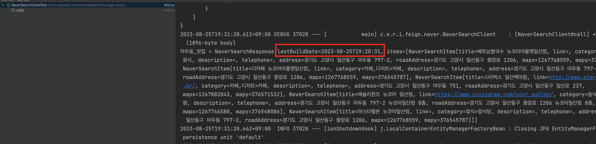

# String to LocalDateTime 변환 오류

## 문제 상황

Naver API를 호출하는 코드를 작성하던 중 `LocalDateTime`으로 역직렬화를 하는 부분에서 자꾸 에러가 발생했다.

- 코드

```java
public record NaverSearchResponse(

	@JsonFormat(shape = JsonFormat.Shape.STRING, pattern = "EEE, dd MMM yyyy HH:mm:ss Z")
	LocalDateTime lastBuildDate, // 문제 발생

	List<NaverSearchItem> items
) {
}
```

- 위의 코드에서 `lastBuildDate`를 파싱해야 하는데 다음과 같은 에러가 발생했다.
- Caused by: java.time.format.DateTimeParseException: Text 'Fri, 25 Aug 2023 19:20:31 +0900' could not be parsed at
  index 0
  at java.base/java.time.format.DateTimeFormatter.parseResolved0(DateTimeFormatter.java:2052)
  at java.base/java.time.format.DateTimeFormatter.parse(DateTimeFormatter.java:1954)
  at java.base/java.time.LocalDateTime.parse(LocalDateTime.java:494)
  at com.fasterxml.jackson.datatype.jsr310.deser.LocalDateTimeDeserializer._fromString(LocalDateTimeDeserializer.java:
  177)
  ... 95 more
- 에러를 보면, `Fri, 25 Aug 2023 19:20:31 +0900`값을 `LocalDateTime`으로 역직렬화하는 과정에서 문제가 생긴 것 같다.

## 해결

- 해당 문제를 해결하기 위해 구글링을 해보니, 뒤에 locale 옵션을 추가하면 해결이 되는 것 같아 다음과 같이 코드를 변경했다.
- 변경한 코드

```java
public record NaverSearchResponse(

	@JsonFormat(shape = JsonFormat.Shape.STRING, pattern = "EEE, dd MMM yyyy HH:mm:ss Z",  locale = "en_GB")
	LocalDateTime lastBuildDate,

	List<NaverSearchItem> items
) {
}
```

- 뒤에 `locale = "en_GB""`를 추가해주었고, 다음과 같이 호출했을 때 정상적으로 호출이 되는 것을 볼 수 있다.

```java
@SpringBootTest
class NaverSearchClientTest {

	@Autowired
	private NaverSearchClient naverSearchClient;

	@Test
	void call() {
		NaverSearchResponse response = naverSearchClient.call("마두동 맛집");
		System.out.println("response = " + response);
	}
}
```



## 참고

https://kaderra.net/dev/spring-java-datetimeformatter-could-not-be-parsed-at-index-0-error/