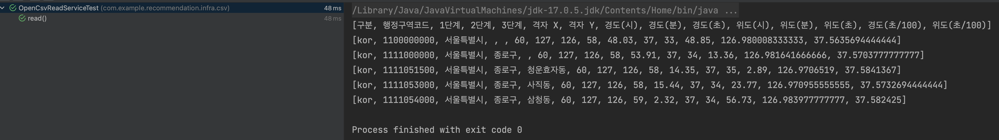

# File Read

## 문제 상황

`OpenCsvReadService`의 테스트 코드를 짜는 과정에서 resources 하위에 있는 csv 파일에 접근해야 하는데, 테스트 코드 실행 시 자꾸 file not found 에러가 발생했다.

### 문제 코드

```java
public List<String[]>read(File file)throws IOException,CsvException{
	CSVReader csvReader=new CSVReader(new FileReader(file)); // 문제 발생
	return csvReader.readAll();
	}
```

### 문제 원인

- 구글링 해본 결과 `File`로 읽을 수 있는 것은 java main 메서드를 실행했을 때 파일 경로를 읽을 수 있는 것이라고 했다.
- 테스트 코드는 main 메서드로 실행하는 것이 아니므로 File 클래스를 통해 읽을 수 없는 것으로 분석된다.
- File 클래스는 왜 main 메서드로에서 실행될 때만 파일 경로를 읽을 수 있는지는 나중에 살펴봐야 겠다..

## 해결

```java
public List<String[]>read(Resource csvFile)throws IOException,CsvException{
	CSVReader csvReader=new CSVReader(new InputStreamReader(csvFile.getInputStream()));
	return csvReader.readAll();
	}
```

### 결론

위의 코드와 같이 `InputStream`을 이용하여 해결했다.


## 참고

https://www.inflearn.com/questions/46489/file-not-found-%EC%A7%88%EB%AC%B8