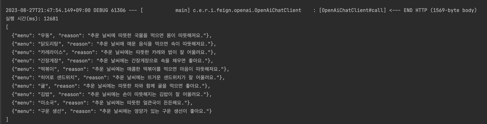

# OpenAI

## 문제 상황

OpenAI API를 호출하는데 시간이 너무 오래 걸리는 문제가 발생했다.
요청 바디는 다음과 같다.

```json
{
  "model": "gpt-3.5-turbo",
  "messages": [
    {
      "role": "system",
      "content": "너는 날씨와 시간에 따른 메뉴를 20자 이하의 간단한 이유와 함께 추천해주는 역할이야. 메뉴는 10개를 추천해줘, json 형식으로 답을 내려줄 수 있어. json 형식 FORMAT: [{menu: 김치찌개, reason: 추운날 속을 풀어준다.}, {menu: , reason: }]"
    },
    {
      "role": "user",
      "content": "다음 상황과 어울리는 메뉴 추천해줘.(COLD, RAINY, AFTERNOON)"
    }
  ]
}
```

위와 같이 요청할 시 시간이 10초 이상 걸려 사용자의 매 요청마다 OpenAI API 호출을 하기 힘들 것이라고 생각되었다.


## 메뉴 추천 수를 줄여보자

사용자에게 메뉴를 10개나 추천할 필요가 없을 것이라고 생각이 되어 메뉴 추천 수를 줄이도록 요구사항을 변경하려고 한다. 3개 변경해보면 요청 바디는 다음과 같다. 위와 거의 유사하고 system 메시지만
변경해보았다.

```json
{
  "model": "gpt-3.5-turbo",
  "messages": [
    {
      "role": "system",
      "content": "너는 날씨와 시간에 따른 메뉴를 20자 이하의 간단한 이유와 함께 추천해주는 역할이야. 메뉴는 3개를 추천해줘, json 형식으로 답을 내려줄 수 있어. json 형식 FORMAT: [{menu: 김치찌개, reason: 추운날 속을 풀어준다.}, {menu: , reason: }]"
    },
    {
      "role": "user",
      "content": "다음 상황과 어울리는 메뉴 추천해줘.(COLD, RAINY, AFTERNOON)"
    }
  ]
}
```

시간이 4초 대로 굉장히 줄은 것을 볼 수 있다. 하지만 매 요청마다 API 호출을 하기에는 아직 부담으러운 시간이라 판단되어 더 시간을 줄일 수 없을까 찾아보았다.


## assistant role을 이용해보자