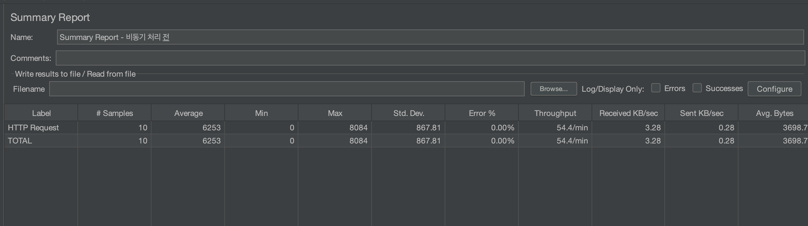
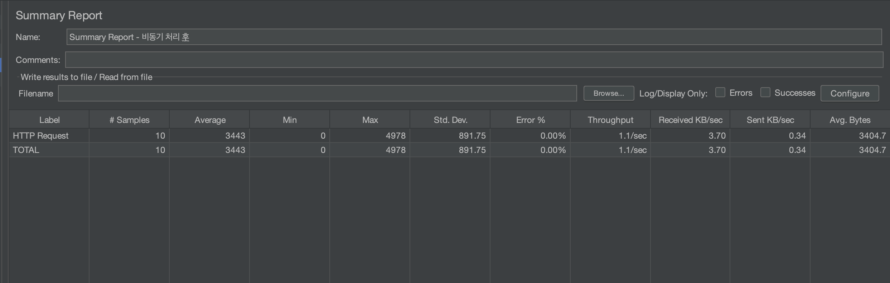

# 시간 지연에 따른 비동기 처리 고민

openai API를 처리하는 과정에서 너무 오래걸린다.

이를 비동기로 바꾸어 처리해보자

## 기존 코드

```java

@Service
public class RecommendFacadeService {

	private final MenuRecommendService menuRecommendService;

	public RecommendFacadeService(MenuRecommendService menuRecommendService) {
		this.menuService = menuService;
	}

	public RecommendResponse recommend(Coordinate coordinate, LocalDateTime targetTime) {

		// 중략

		List<MenuResponse> menuResponses = new ArrayList<>();
		for (int i = 0; i < 3; i++) {
			menuResponses.add(menuService.findMenuList(FindMenuRequest.from(weatherResponseForTimes)));
		}

		// 중략
	}
}

```

### 성능

JMeter로 측정, 5초간 10개의 요청


## 비동기 적용

```java

@Service
public class RecommendFacadeService {

	private final MenuRecommendService menuRecommendService;

	public RecommendFacadeService(MenuRecommendService menuRecommendService) {
		this.menuService = menuService;
	}

	public RecommendResponse recommend(Coordinate coordinate, LocalDateTime targetTime) {

		// 중략

		// 날씨와 시간으로 메뉴 추천
		List<CompletableFuture<MenuResponse>> futures = new ArrayList<>();

		for (int i = 0; i < 3; i++) {
			CompletableFuture<MenuResponse> menuResponseCompletableFuture = CompletableFuture.supplyAsync(
				() -> menuService.findMenuList(FindMenuRequest.from(weatherResponseForTimes)));

			futures.add(menuResponseCompletableFuture);
		}

		List<MenuResponse> menuResponses = CompletableFuture.allOf(futures.toArray(new CompletableFuture[0]))
			.thenApply(o -> futures.stream()
				.map(CompletableFuture::join)
				.toList())
			.join();

		// 중략
	}
}

```

### 성능

